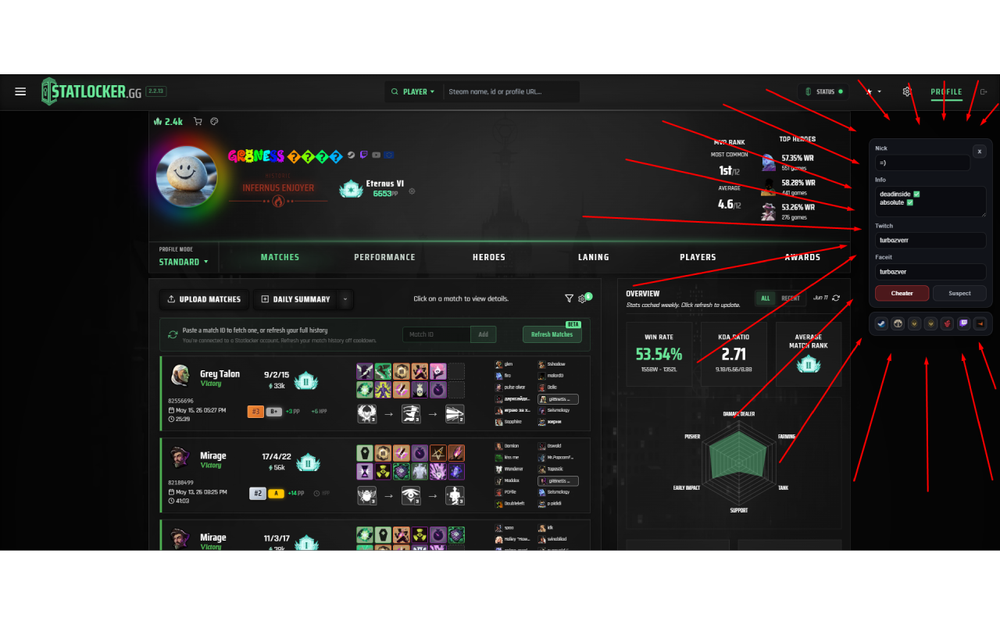
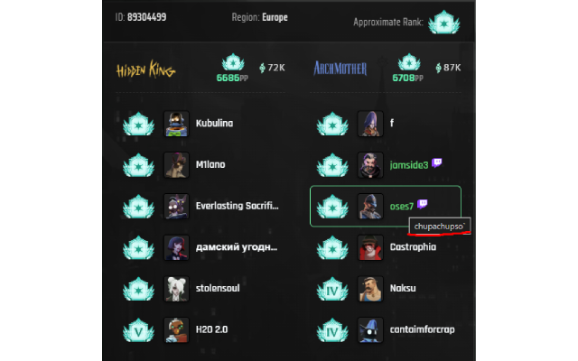
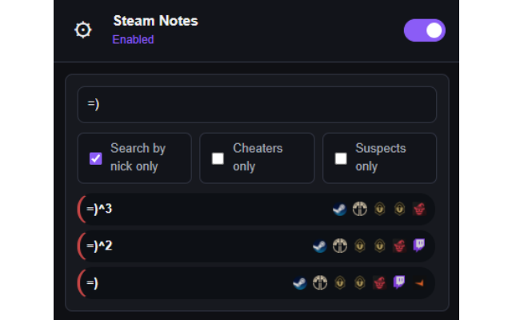

# Steam Notes

Local notes for Steam, Tracklock, Statlocker, Faceit, and Twitch profiles.

## Features

- Add nickname, notes, Twitch/Faceit usernames, and status flags for players
- Show saved notes directly on supported profile pages
- Highlight saved players on Statlocker active match pages
- Show matching saved player links on Twitch channels
- Toggle static Steam, Tracklock, Statlocker, Deadlock API, Twitch, and Faceit links
- Search, filter, edit, and remove saved notes from the popup

## Supported Pages

- `steamcommunity.com/id/*`
- `steamcommunity.com/profiles/*`
- `tracklock.gg/players/*`
- `statlocker.gg/profile/*`
- `statlocker.gg/active-matches*`
- `twitch.tv/*`

## Privacy

Steam Notes stores all notes locally in browser storage. It does not send note data to an external server.

## Installation

- 🟢 [Chrome Web Store](https://chromewebstore.google.com/detail/lbfngajejkhbnlmjpfdafaoppjgpblcf)
- 🦊 [Firefox Add-ons](https://addons.mozilla.org/firefox/addon/steam-notes/)

## Screenshots

**1. Notes panel on a Statlocker player profile**

**2. Saved players highlighted in Statlocker Active Matches**

The locally saved nickname `oses7` is displayed even though current Steam nickname is <code>chupachupso`</code>.

**3. Saved account list in the popup**

## Contributing

Feel free to open issues or submit pull requests to improve the extension.
